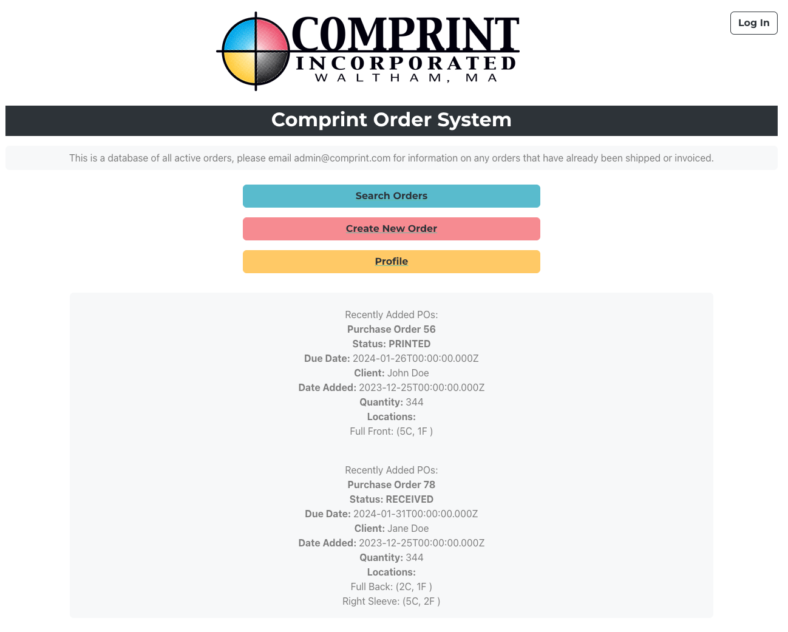
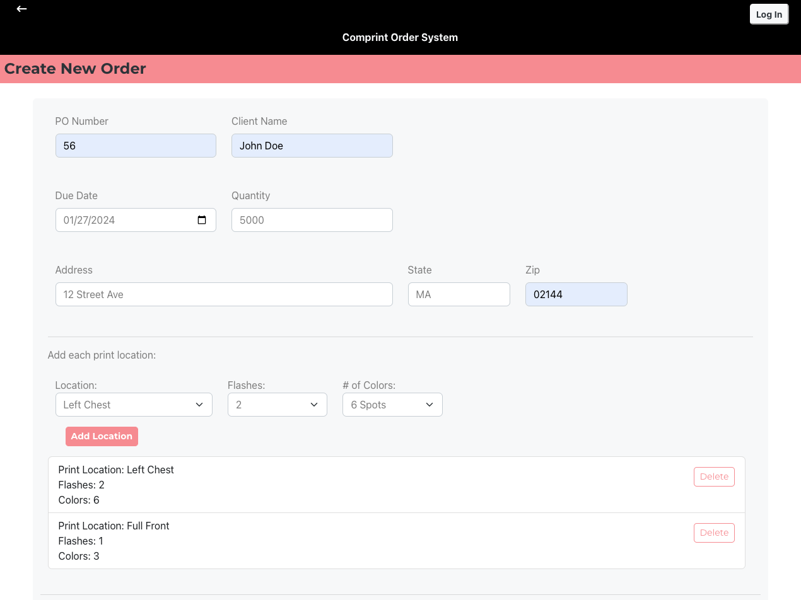
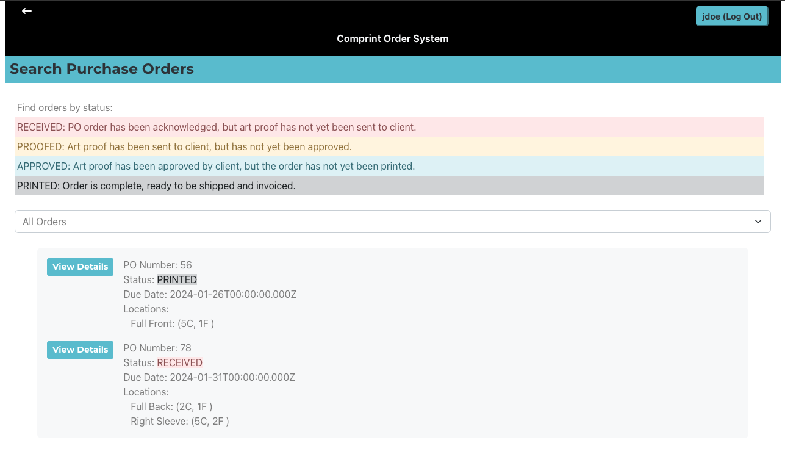
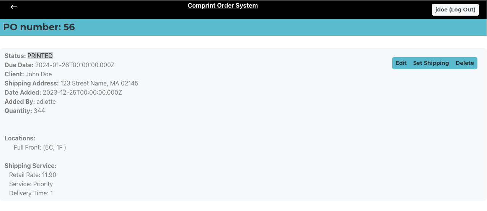
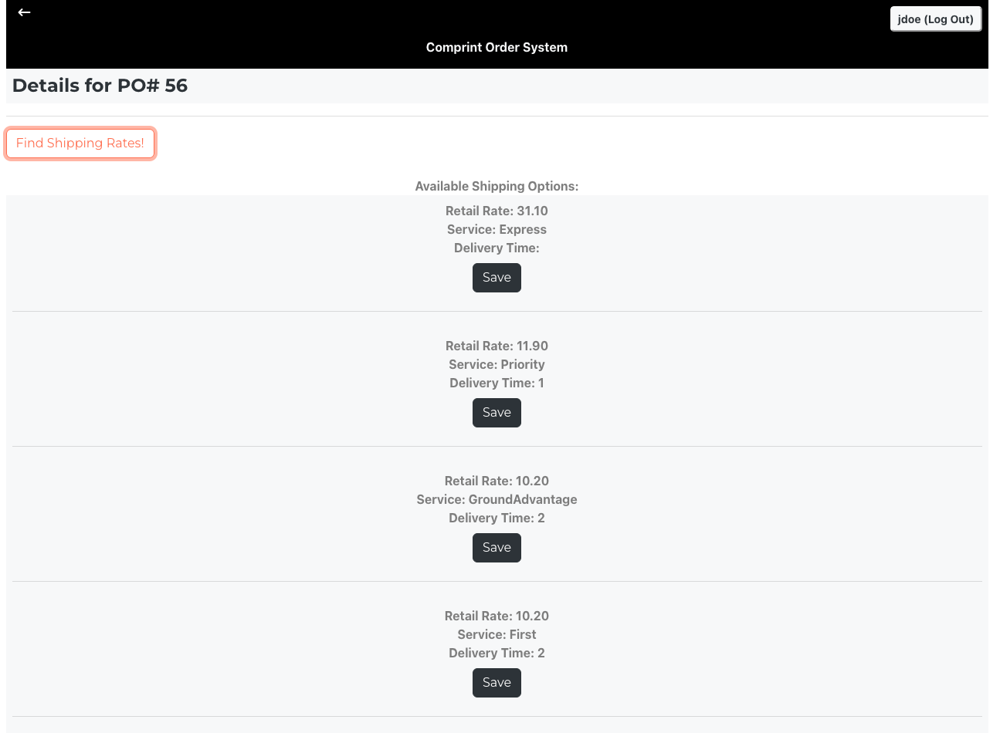
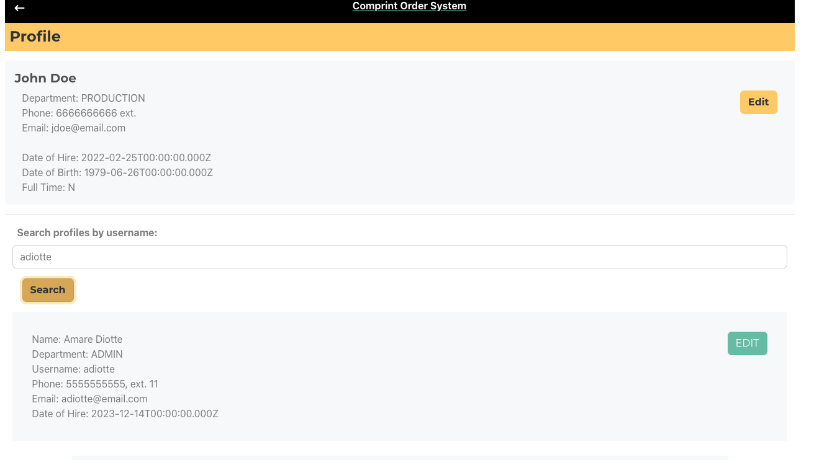
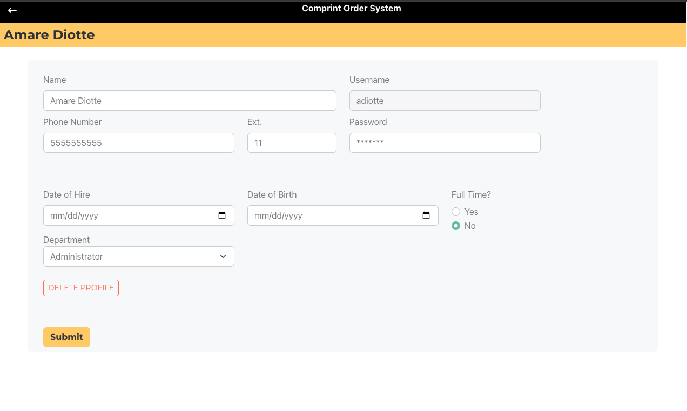

# Online Order System for a Contract Screen Printer
### Full MERN stack web application - Front End
This was a project for school, but it was inspired by real life. While I was getting my Master's, I was also working as a graphic designer at a screen printing shop with an incredibly archiac order system. It involved physically printing purchase orders to track them. So, if you needed to update an order, you had to figure out where the physical copies of the order were being kept and update them all by hand. My goal was to create a centralized order system where all parts of the company from the admins who were receiving the orders, the artists proofing the orders, and the folks in production printing the orders, they would all have easy access to the orders and could make the needed updates once. But they would only have the privileges to make changes to orders that aligned with their role and any additions or changes made would have the user's name tied to it, in case there were any questions or problems.
##
<div>
    <div style="display: block; margin: 0 auto; padding-top: 10px;"> 
    From the landing page, you can login the top right. Or choose one of the three options in the center. Below is a feed showing the most recently added orders in the system. If the user is logged in under the "shipping" department, there is a fourth button underneath for "get shipping info".  
    </div>
    <figure>
        <figcaption style="padding-top: 5px;"><i>Landing Page</i></figcaption>
         
    </figure>
</div>
<div style=
        "padding-top: 5px;
        clear: both;
        border-top: 1px solid;"
        ></div>


<div style="display: block; margin: 0 auto; padding-top: 10px;"> 
      Clicking the pink "create new order button" brings you to this form to submit a new order. An order can contain a number of different print locations that will be priced and printed differently, so it was important the order system could handle a number of different types of prints and attributes. Upon submission, the <a ref="https://github.com/diotte-am/WebDevFinalProjectServer"> web server</a> will create a new PO entry in the connected MongoDB databases. The user who created the purchase order will be recorded.
</div>
 <figure >
   <figcaption style="padding-top: 5px;"><i>Create a new order</i></figcaption>
     
 </figure>


<div style="padding-top: 5px;
        clear: both;
        border-top: 1px solid;"></div>


<div style="display: block; margin: 0 auto; padding-top: 10px;"> 
      Clicking on the blue "Search Order" button on the landing page will bring you to a screen where you can view all orders. Or filter by print status. The print status reflects how much of the job is completed, as the user completes their segment of the job, they are able to update the status of that order. For example, someone in the art department sucessfully proofs a client and gets an approval to move to production, they are able to set the status from "PROOFED" to "APPROVED".
</div>
 <figure>
    <figcaption style="padding-top: 5px;"><i>View All Orders</i></figcaption>
     
 </figure>


<div style="padding-top: 5px;
        clear: both;
        border-top: 1px solid;"></div>

<div>
<div style="display: block; margin: 0 auto; padding-top: 10px;"> 
      Clicking on the "view details" button will bring you to a page with more information on the order, and three buttons:
      <ul>
        <li> <b>Edit:</b> links to a form where the user can update personal information like address.
        <li> <b>Set Shipping:</b> *Shipping users only* Uses Easy Post API to get shipping rates and times. Shipping data can be added to the PO entry on this screen
        <li> <b>Delete:</b> deletes current PO from the database
      </ul>
</div>
 <figure>
    <figcaption style="padding-top: 5px;"><i>View Details of Purchase Order</i></figcaption>
     
 </figure>
</div>

<div style="padding-top: 5px;
        clear: both;
        border-top: 1px solid;"></div>

<div>
<div style="display: block; margin: 0 auto; padding-top: 10px;"> 
    Shipping data is retreived using the <a href="http://www.easypost.com">Easy Post API</a>. Only users with shipping credentials will have access to this page. Click the button corresponding with your desired shipping method and it will be added to the current PO. If a shipping method is already on that order, it will be overwritten. The last user to update the shipping is recorded.
</div>
 <figure>
    <figcaption style="padding-top: 5px;"><i>View Details of Purchase Order</i></figcaption>
     
 </figure>
</div>
<div style="padding-top: 5px;
        clear: both;
        border-top: 1px solid;"></div>

<div>
<div style="display: block; margin: 0 auto; padding-top: 10px;"> 
      Look up other users to view their details. From this page, hit the "Edit" button to go to a form where that user's details can be update. The fields the user is able to update will depend on what department the user is assigned to. Administrators have the most options on this page.
</div>
 <figure>
    <figcaption style="padding-top: 5px;"><i>Search for a profile</i></figcaption>
     
 </figure>
</div>
<div style="padding-top: 5px;
        clear: both;
        border-top: 1px solid;"></div>


<div>
<div style="display: block; margin: 0 auto; padding-top: 10px;"> 
      Users are be able to update their personal details - name, email, address, phone number. Users with Admin credentials will also be able to delete this profile, change to full or part time, or change department.
</div>
 <figure>
    <figcaption style="padding-top: 5px;"><i>Edit a user's profile</i></figcaption>
     
 </figure>
</div>
<div style="padding-top: 5px;
        clear: both;
        border-top: 1px solid;"></div>


<div style="padding-top: 5px;
        clear: both;
        border-top: 1px solid;"></div>

## Compilation Instructions

This application was written in Spring of 2022 and since then all of the modules I used have since updated or become deprecated. To get this running all dependencies will need to be reinstalled:

```
npm install
```


In my case, this installation resulted in a long list of vulnerabilities, so it may be necessary to run an audit:

```
npm audit fix
```


Run the application with this command.

```
npm start
```


If the <a ref="https://github.com/diotte-am/WebDevFinalProjectServer"> web server</a> isn't running already running at this point, you'll get a network error, but you'll still be able to navigate the website.

